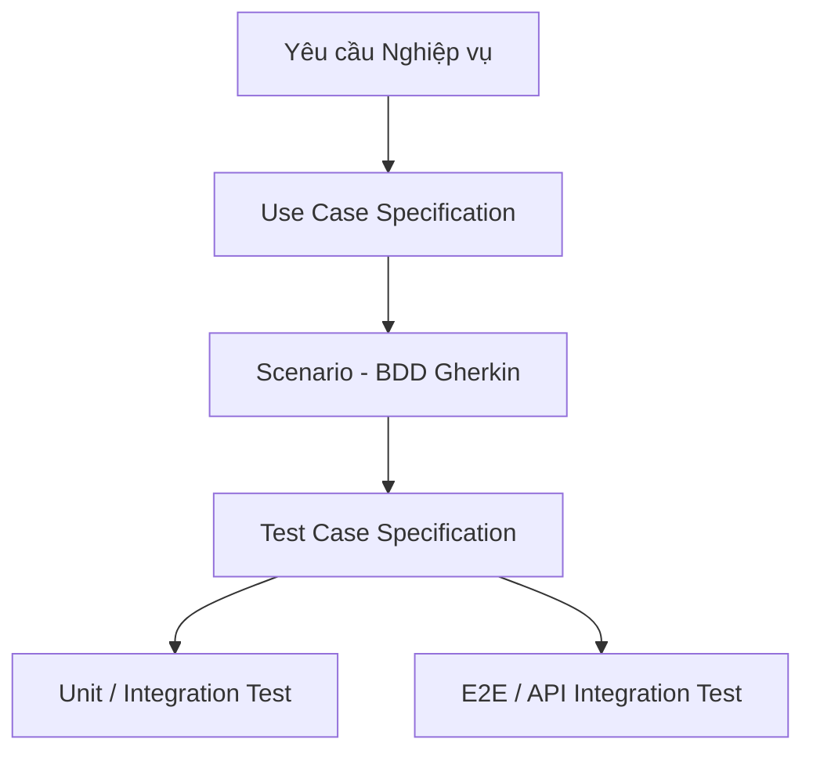

# Hướng dẫn và Đặc tả chi tiết: Use Case, Scenario, Test Case & Unit/E2E Test

Tài liệu này cung cấp một hướng dẫn thực tiễn, toàn diện và đầy đủ nhất về cách thiết kế, chuyển đổi các yêu cầu nghiệp vụ thành **Use Case**, **Scenario (BDD)**, **Test Case**, và cuối cùng là triển khai kiểm thử tự động (**Unit Test & E2E Test**) trong dự án **RAMP UP (Glinteco e-Learning BE)** chạy trên nền tảng NestJS.

---

## I. Tổng quan về Quy trình Phát triển và Kiểm thử

Quy trình phát triển phần mềm chuẩn hướng chất lượng (Quality-Driven Development) đi từ trừu tượng đến cụ thể như sau:



1. **Use Case**: Định nghĩa hành vi của hệ thống từ góc nhìn của tác nhân (Actor). Nó trả lời câu hỏi: *Tác nhân muốn đạt được mục tiêu gì và hệ thống phản hồi ra sao?*
2. **Scenario (Kịch bản BDD)**: Cụ thể hóa luồng Use Case dưới dạng các kịch bản thực tế bằng ngôn ngữ tự nhiên thông qua cú pháp `Given - When - Then`. Giúp BA, QA và Developer có chung một ngôn ngữ hiểu biết.
3. **Test Case**: Là tài liệu kiểm thử chi tiết gồm các bước (Steps), dữ liệu đầu vào (Inputs), và kết quả kỳ vọng (Expected Outputs) dùng để QA kiểm thử thủ công hoặc làm nền tảng viết code test.
4. **Unit / E2E Test**: Chuyển đổi các kịch bản kiểm thử thành mã nguồn chạy tự động để đảm bảo hệ thống không bị lỗi lũy tiến (Regression) khi thay đổi mã nguồn.

---

## II. Phân hệ 1: Quản lý bài nộp (Submissions Module)

Phân hệ này quản lý việc nộp bài tập của học viên (Learner) thông qua URL Pull Request trên GitHub và việc đánh giá, phản hồi từ phía Quản trị viên (Admin).

### 1. Đặc tả Use Case (Use Case Specification)

#### Use Case: UC-SUB-01 - Nộp Bài tập (Learner)
* **Actor**: Học viên (Learner)
* **Preconditions**:
  * Học viên đã đăng nhập hệ thống và có mã JWT hợp lệ.
  * Bài tập (Exercise) tồn tại trong hệ thống và thuộc về Track mà học viên đang kích hoạt.
* **Basic Flow**:
  1. Học viên gửi yêu cầu nộp bài tập chứa `exerciseId` và `prUrl`.
  2. Hệ thống kiểm tra tính hợp lệ của định dạng GitHub PR URL (phải khớp regex: `^https:\/\/github\.com\/[^\/]+\/[^\/]+\/pull\/[0-9]+$`).
  3. Hệ thống kiểm tra xem bài tập này đã có bản ghi nộp bài nào chưa.
  4. Nếu chưa có, hệ thống tạo mới bản ghi `Submission` với trạng thái `SUBMITTED`.
  5. Hệ thống tạo thêm bản ghi `SubmissionHistory` để lưu dấu vết người nộp, thời gian và sự kiện.
  6. Hệ thống trả về trạng thái `201 Created` cùng thông tin chi tiết bài nộp.
* **Alternative Flows**:
  * *Học viên nộp lại bài tập (Resubmit)*: Nếu hệ thống phát hiện đã có bài nộp trước đó ở trạng thái `CHANGES_REQUESTED` (Yêu cầu sửa đổi), hệ thống sẽ cho phép cập nhật lại `prUrl` mới, chuyển trạng thái về `SUBMITTED`, lưu thêm lịch sử với hành động là `RESUBMITTED`.
* **Exception Flows**:
  * *PR URL không hợp lệ*: Trả về lỗi `400 Bad Request` chứa thông điệp lỗi validation chi tiết.
  * *Bài tập không tồn tại*: Trả về lỗi `404 Not Found`.

#### Use Case: UC-SUB-02 - Đánh giá và Chấm điểm (Admin)
* **Actor**: Quản trị viên (Admin)
* **Preconditions**:
  * Admin đăng nhập hệ thống thành công (JWT chứa vai trò `admin`).
  * Bản ghi bài nộp (`Submission`) tồn tại và đang ở trạng thái `SUBMITTED`.
* **Basic Flow**:
  1. Admin gửi yêu cầu đánh giá bài nộp chứa `submissionId`, trạng thái đích (`status` là `APPROVED` hoặc `CHANGES`), và nhận xét (`comment`).
  2. Hệ thống kiểm tra quyền hạn của người thực hiện thông qua `RolesGuard`.
  3. Hệ thống kiểm tra tính hợp lệ của trạng thái đích (không cho phép tự chuyển về trạng thái ban đầu).
  4. Hệ thống cập nhật trạng thái của bản ghi `Submission`.
  5. Hệ thống tạo bản ghi `SubmissionHistory` lưu tên Admin, thời gian chấm và nội dung nhận xét.
  6. Hệ thống trả về kết quả thành công `200 OK`.
* **Exception Flows**:
  * *Không có quyền (Role Learner)*: Trả về lỗi `403 Forbidden` khi người dùng thường cố tình gọi API này.

---

### 2. Kịch bản BDD (Scenario - Gherkin)

#### Scenario 1: Học viên nộp bài tập lần đầu thành công
```gherkin
Given Học viên có tài khoản hợp lệ với vai trò "learner" và đã đăng nhập
  And Bài tập với ID "ex-10" có tồn tại trên hệ thống
When Học viên gửi yêu cầu POST tới "/exercises/ex-10/submissions" với payload:
  | prUrl | https://github.com/glinteco/project/pull/42 |
Then Hệ thống sẽ tạo mới một bản ghi bài nộp
  And Trạng thái của bài nộp được đặt là "SUBMITTED"
  And Trả về mã HTTP Status "201 Created" chứa ID bài nộp vừa tạo
```

#### Scenario 2: Học viên gửi đường dẫn PR GitHub sai định dạng
```gherkin
Given Học viên đã đăng nhập thành công
When Học viên gửi yêu cầu POST tới "/exercises/ex-10/submissions" với payload:
  | prUrl | https://google.com/not-github-pr |
Then Hệ thống từ chối yêu cầu
  And Không tạo mới bản ghi bài nộp nào trong cơ sở dữ liệu
  And Trả về mã HTTP Status "400 Bad Request" kèm thông báo validation định dạng URL
```

#### Scenario 3: Admin duyệt bài nộp hợp lệ
```gherkin
Given Người dùng đăng nhập tài khoản vai trò "admin"
  And Có bài nộp ID "sub-50" đang ở trạng thái "SUBMITTED"
When Admin gửi yêu cầu POST tới "/submissions/sub-50/approve" với payload:
  | comment | Thuật toán tối ưu, viết test đầy đủ. Duyệt! |
Then Hệ thống cập nhật trạng thái bài nộp "sub-50" thành "APPROVED"
  And Bản ghi lịch sử được tạo mới lưu nhận xét của Admin
  And Trả về mã HTTP Status "200 OK"
```

---

### 3. Ca Kiểm thử Chi tiết (Test Case Specification)

| Test Case ID | Mục tiêu kiểm thử | Dữ liệu đầu vào (Input) | Các bước thực hiện | Kết quả mong đợi (Expected Output) |
| :--- | :--- | :--- | :--- | :--- |
| **TC_SUB_01** | Nộp bài thành công (Lần đầu) | Header: JWT Learner<br>Params: `id = ex-10`<br>Body: `{ "prUrl": "https://github.com/user/repo/pull/1" }` | 1. Gửi request POST tới `/exercises/ex-10/submissions` với token học viên.<br>2. Kiểm tra dữ liệu trong DB. | - HTTP Status: `201 Created`. <br>- Body chứa thông tin bài nộp có trạng thái là `SUBMITTED`. |
| **TC_SUB_02** | Nộp bài lỗi định dạng PR URL | Header: JWT Learner<br>Params: `id = ex-10`<br>Body: `{ "prUrl": "not_a_valid_github_url" }` | 1. Gửi request POST tới `/exercises/ex-10/submissions` với URL sai định dạng. | - HTTP Status: `400 Bad Request`.<br>- Thông báo lỗi chỉ rõ định dạng PR URL không hợp lệ. |
| **TC_SUB_03** | Duyệt bài nộp thành công (Admin) | Header: JWT Admin<br>Params: `id = sub-50`<br>Body: `{ "comment": "Tốt" }` | 1. Gửi request POST tới `/submissions/sub-50/approve` với token của quản trị viên. | - HTTP Status: `200 OK`.<br>- Trường trạng thái cập nhật thành `APPROVED`. |
| **TC_SUB_04** | Học viên cố tình duyệt bài nộp | Header: JWT Learner<br>Params: `id = sub-50`<br>Body: `{ "comment": "Hack" }` | 1. Gửi request duyệt bài bằng token của học viên. | - HTTP Status: `403 Forbidden` do vi phạm phân quyền chặn bởi RolesGuard. |

---

### 4. Triển khai Unit Test & Integration Test

#### 4.1. Unit Test cho Controller (`submissions.controller.spec.ts`)
Chúng ta kiểm tra xem Controller có nhận diện đúng các tham số đầu vào và truyền xuống Service tương ứng hay không.

```typescript
import { Test, TestingModule } from '@nestjs/testing';
import { SubmissionsController } from './submissions.controller';
import { SubmissionsService } from './submissions.service';
import { SubmissionStatus } from '../database/entities/submission.entity';
import { JwtAuthGuard } from '../modules/auth/guards/jwt-auth.guard';
import { RolesGuard } from '../modules/auth/guards/roles.guard';

describe('SubmissionsController', () => {
  let controller: SubmissionsController;

  const mockSubmissionsService = {
    submit: jest.fn(),
    review: jest.fn(),
  };

  beforeEach(async () => {
    const module: TestingModule = await Test.createTestingModule({
      controllers: [SubmissionsController],
      providers: [
        { provide: SubmissionsService, useValue: mockSubmissionsService },
      ],
    })
      .overrideGuard(JwtAuthGuard)
      .useValue({ canActivate: () => true })
      .overrideGuard(RolesGuard)
      .useValue({ canActivate: () => true })
      .compile();

    controller = module.get<SubmissionsController>(SubmissionsController);
  });

  describe('submit', () => {
    it('TC_SUB_01: should delegate submit to service and return 201', async () => {
      const mockRequest = { user: { id: 'user-123', role: 'learner' } };
      const dto = { prUrl: 'https://github.com/glinteco/elearning/pull/10' };
      const expectedOutput = { id: 'sub-001', status: SubmissionStatus.SUBMITTED };
      
      mockSubmissionsService.submit.mockResolvedValue(expectedOutput);

      const result = await controller.submit('ex-10', dto, mockRequest as any);

      expect(mockSubmissionsService.submit).toHaveBeenCalledWith(
        'ex-10',
        'user-123',
        dto.prUrl
      );
      expect(result).toEqual(expectedOutput);
    });
  });
});
```

#### 4.2. Unit Test cho Service nghiệp vụ (`submissions.service.spec.ts`)
Kiểm tra các luật nghiệp vụ (Business Logic) và các trường hợp lỗi ném ra ngoại lệ.

```typescript
import { Test, TestingModule } from '@nestjs/testing';
import { SubmissionsService } from './submissions.service';
import { getRepositoryToken } from '@nestjs/typeorm';
import { Submission, SubmissionStatus } from '../database/entities/submission.entity';
import { SubmissionHistory } from '../database/entities/submission-history.entity';
import { Exercise } from '../database/entities/exercise.entity';
import { NotFoundException } from '@nestjs/common';

describe('SubmissionsService', () => {
  let service: SubmissionsService;

  const mockSubmissionRepo = {
    findOne: jest.fn(),
    create: jest.fn(),
    save: jest.fn(),
  };
  const mockHistoryRepo = {
    create: jest.fn(),
    save: jest.fn(),
  };
  const mockExerciseRepo = {
    findOne: jest.fn(),
  };

  beforeEach(async () => {
    const module: TestingModule = await Test.createTestingModule({
      providers: [
        SubmissionsService,
        { provide: getRepositoryToken(Submission), useValue: mockSubmissionRepo },
        { provide: getRepositoryToken(SubmissionHistory), useValue: mockHistoryRepo },
        { provide: getRepositoryToken(Exercise), useValue: mockExerciseRepo },
      ],
    }).compile();

    service = module.get<SubmissionsService>(SubmissionsService);
  });

  describe('submit', () => {
    it('should throw NotFoundException if exercise does not exist', async () => {
      mockExerciseRepo.findOne.mockResolvedValue(null);

      await expect(
        service.submit('ex-999', 'user-1', 'https://github.com/user/repo/pull/1')
      ).rejects.toThrow(NotFoundException);
    });

    it('should save submission and create history logs', async () => {
      const mockExercise = { id: 'ex-10', title: 'Test Exercise' };
      mockExerciseRepo.findOne.mockResolvedValue(mockExercise);

      const expectedSubmission = {
        id: 'sub-1',
        exerciseId: 'ex-10',
        userId: 'user-1',
        prUrl: 'https://github.com/user/repo/pull/1',
        status: SubmissionStatus.SUBMITTED,
      };

      mockSubmissionRepo.create.mockReturnValue(expectedSubmission);
      mockSubmissionRepo.save.mockResolvedValue(expectedSubmission);

      const result = await service.submit('ex-10', 'user-1', 'https://github.com/user/repo/pull/1');

      expect(mockSubmissionRepo.save).toHaveBeenCalled();
      expect(mockHistoryRepo.save).toHaveBeenCalled();
      expect(result).toEqual(expectedSubmission);
    });
  });
});
```

---

## III. Phân hệ 2: Xác thực & Phân quyền (Auth Module)

Phân hệ này xử lý đăng nhập qua Google OAuth2, cấp phát và quản lý JWT Token cũng như phân loại quyền lực (Learner vs Admin).

### 1. Đặc tả Use Case (Use Case Specification)

#### Use Case: UC-AUTH-01 - Đăng nhập bằng Google (Google Login)
* **Actor**: Học viên / Quản trị viên
* **Preconditions**: Người dùng đã có một tài khoản Google hợp lệ.
* **Basic Flow**:
  1. Người dùng gửi mã Token nhận được từ Google OAuth2 Client (`idToken`) lên máy chủ.
  2. Máy chủ sử dụng thư viện `google-auth-library` để xác thực tính hợp lệ của token này với Google API.
  3. Sau khi xác thực thành công, hệ thống lấy ra các thông tin cá nhân: `email`, `name`, `picture`.
  4. Hệ thống kiểm tra xem email này đã tồn tại trong cơ sở dữ liệu hệ thống chưa.
     * Nếu đã có: Lấy thông tin tài khoản hiện tại.
     * Nếu chưa có: Tạo mới một người dùng (User) với vai trò mặc định là `LEARNER`.
  5. Hệ thống tạo cặp mã JWT Token bao gồm: `accessToken` (thời hạn ngắn, dùng để gọi API) và `refreshToken` (thời hạn dài, lưu DB để gia hạn).
  6. Hệ thống trả về thông tin người dùng và bộ token mới.

---

### 2. Kịch bản BDD (Scenario)

#### Scenario 1: Đăng nhập thành công bằng tài khoản Google mới
```gherkin
Given Người dùng nhận được idToken hợp lệ từ Google Client SDK
When Người dùng gửi POST "/auth/google" chứa idToken hợp lệ
Then Hệ thống xác thực thông tin tài khoản với Google API thành công
  And Tạo một tài khoản User mới trong DB với email từ Google
  And Cấp cặp mã accessToken và refreshToken
  And Trả về mã phản hồi "201 Created" cùng thông tin cá nhân
```

#### Scenario 2: Đăng nhập thất bại do Token giả mạo hoặc hết hạn
```gherkin
Given Người dùng gửi một idToken tự chế hoặc đã quá hạn
When Người dùng gửi POST "/auth/google" chứa token này
Then Hệ thống từ chối xác thực tài khoản
  And Trả về lỗi bảo mật "401 Unauthorized"
```

---

### 3. Ca Kiểm thử Chi tiết (Test Case Specification)

| Test Case ID | Mục tiêu kiểm thử | Dữ liệu đầu vào (Input) | Các bước thực hiện | Kết quả mong đợi (Expected Output) |
| :--- | :--- | :--- | :--- | :--- |
| **TC_AUTH_01** | Đăng nhập thành công | Header: Trống<br>Body: `{ "idToken": "valid_google_token_xyz" }` | 1. Gửi request POST tới `/auth/google`. | - HTTP Status: `201 Created`.<br>- Trả về `accessToken` và thông tin `email`. |
| **TC_AUTH_02** | Đăng nhập thất bại với token lỗi | Header: Trống<br>Body: `{ "idToken": "invalid_or_expired_token" }` | 1. Gửi request POST tới `/auth/google` kèm token lỗi. | - HTTP Status: `401 Unauthorized`. |

---

### 4. Triển khai E2E Integration Test (Kiểm thử Tích hợp Toàn diện)

E2E test giúp kiểm thử toàn bộ luồng từ HTTP Request, đi qua các Guards, qua Controller, Service, kết nối cơ sở dữ liệu thật (hoặc DB testing riêng biệt) mà không mock logic.

Sử dụng thư viện `supertest` và `@nestjs/testing`:

```typescript
import { Test, TestingModule } from '@nestjs/testing';
import { INestApplication, ValidationPipe } from '@nestjs/common';
import * as request from 'supertest';
import { AppModule } from '../src/app.module';
import { getRepositoryToken } from '@nestjs/typeorm';
import { User, UserRole } from '../src/database/entities/user.entity';
import { Connection } from 'typeorm';

describe('Auth & Submissions E2E Test Flow', () => {
  let app: INestApplication;
  let moduleFixture: TestingModule;
  let dbConnection: Connection;
  let userToken: string;
  let adminToken: string;

  beforeAll(async () => {
    moduleFixture = await Test.createTestingModule({
      imports: [AppModule],
    }).compile();

    app = moduleFixture.createNestApplication();
    app.useGlobalPipes(new ValidationPipe());
    await app.init();

    dbConnection = moduleFixture.get<Connection>(Connection);
  });

  afterAll(async () => {
    // Dọn dẹp kết nối cơ sở dữ liệu sau khi kết thúc test
    await dbConnection.close();
    await app.close();
  });

  // Kiểm thử phân quyền - chặn học viên truy cập tài nguyên admin
  it('GET /submissions -> Should return 403 Forbidden for Learners', async () => {
    // Tạo token giả lập cho học viên (Learner)
    const mockUserJwt = 'bearer_token_cua_learner_sau_khi_sign_jwt';
    
    return request(app.getHttpServer())
      .get('/submissions')
      .set('Authorization', `Bearer ${mockUserJwt}`)
      .expect(403); // Đảm bảo trả về lỗi Forbidden do sai quyền
  });

  // Kiểm thử nộp bài và lỗi validation dữ liệu
  it('POST /exercises/:id/submissions -> Should return 400 Bad Request if URL invalid', async () => {
    const mockUserJwt = 'jwt_token_learner_hop_le';

    return request(app.getHttpServer())
      .post('/exercises/ex-1/submissions')
      .set('Authorization', `Bearer ${mockUserJwt}`)
      .send({ prUrl: 'not_a_valid_github_url' })
      .expect(400) // Yêu cầu phải báo lỗi bad request
      .expect((res) => {
        expect(res.body.message).toContain('prUrl must be a URL address');
      });
  });
});
```

---

## IV. Các nguyên tắc vàng khi thiết kế kiểm thử (Testing Best Practices)

1. **Quy tắc AAA (Arrange - Act - Assert)**:
   * **Arrange**: Thiết lập dữ liệu giả lập (Mock, DTO, Entities).
   * **Act**: Gọi phương thức cần kiểm thử (gọi hàm Service/Controller).
   * **Assert**: So sánh kết quả trả về hoặc hành vi tương tác với mong đợi (`expect(...)`).
2. **Luôn Mock tầng bên dưới (Isolation)**:
   * Khi test Controller, hãy mock Service.
   * Khi test Service, hãy mock Database Repositories hoặc Third-party APIs (Google, GitHub, Mailer).
3. **Độ bao phủ kiểm thử (Test Coverage)**:
   * Chạy lệnh `pnpm run test:cov` để kiểm tra độ phủ của mã nguồn.
   * Đảm bảo tất cả các nhánh rẽ điều kiện (`if/else`), các bắt lỗi (`try/catch`) đều được phủ bởi ít nhất một ca kiểm thử.
4. **Viết tên kiểm thử rõ nghĩa**:
   * Nên mô tả rõ: *Điều kiện là gì* -> *Hành động thực hiện* -> *Kết quả trả về*.
   * Ví dụ: `it('should throw NotFoundException when updating a non-existent cohort')`.
