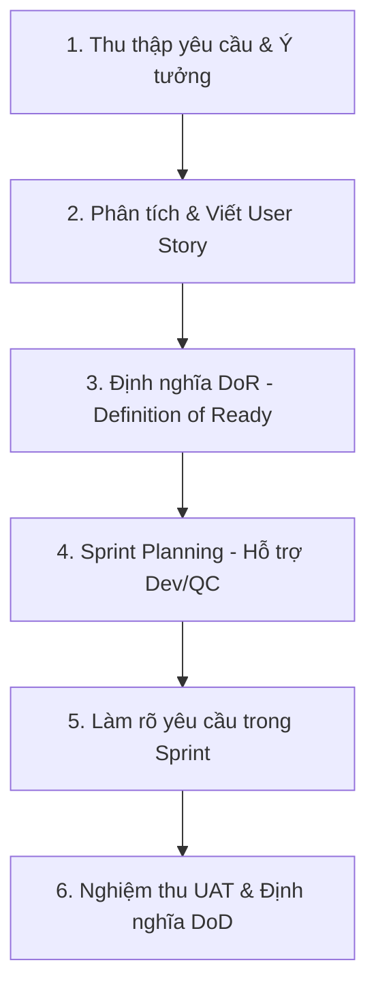

# QUY CHUẨN TÀI LIỆU NGHIỆP VỤ (BA STANDARDS)
**Dự án:** RAMP UP (Glinteco e-Learning)  
**Tác giả:** Senior Business Analyst  
**Phiên bản:** 1.0  
**Ngày cập nhật:** 16/06/2026  

---

## 1. Tổng quan & Quy trình làm việc (BA Workflow)

Tài liệu này định nghĩa các tiêu chuẩn nghiệp vụ bắt buộc đối với mọi thành viên phát triển dự án RAMP UP. Quy chuẩn này đảm bảo sự đồng bộ từ khâu mô tả tính năng (Business Requirements), triển khai kỹ thuật (Development) cho đến kiểm thử chất lượng (Quality Control) và nghiệm thu người dùng (UAT).

### Quy trình BA trong vòng đời Sprint (Agile/Scrum):


**Sơ đồ dạng chữ (ASCII Diagram):**
```text
┌──────────────────────────────┐
│  1. Thu thập yêu cầu/Ý tưởng │
└──────────────┬───────────────┘
               │
               ▼
┌──────────────────────────────┐
│ 2. Phân tích & Viết UserStory│
└──────────────┬───────────────┘
               │
               ▼
┌──────────────────────────────┐
│     3. Định nghĩa DoR        │
└──────────────┬───────────────┘
               │
               ▼
┌──────────────────────────────┐
│ 4. Sprint Planning (Dev/QC)  │
└──────────────┬───────────────┘
               │
               ▼
┌──────────────────────────────┐
│ 5. Làm rõ yêu cầu trong Sprint│
└──────────────┬───────────────┘
               │
               ▼
┌──────────────────────────────┐
│   6. Nghiệm thu UAT & DoD    │
└──────────────────────────────┘
```

1. **Phân tích (Analysis):** BA phối hợp với Product Owner (PO) và Technical Lead để phân tích luồng nghiệp vụ, giao diện (mockup) và xác định phạm vi công việc.
2. **Soạn thảo (Drafting):** Viết User Story kèm theo Kịch bản nghiệm thu (Acceptance Criteria - AC) chi tiết bằng ngôn ngữ Gherkin.
3. **Thẩm định (Definition of Ready - DoR):** Story chỉ được đưa vào Sprint Backlog khi đạt tiêu chuẩn Ready.
4. **Hỗ trợ (Support):** Trong Sprint, BA giải đáp thắc mắc của Dev & QC về nghiệp vụ.
5. **Nghiệm thu (UAT):** BA thực hiện nghiệm thu sản phẩm dựa trên UAT Test Case trước khi tính năng được bàn giao.

---

## 2. Tiêu chuẩn viết User Story

Mỗi tính năng/yêu cầu nghiệp vụ phải được mô tả dưới dạng một **User Story** độc lập, bám sát nguyên tắc **INVEST**:
* **I**ndependent (Độc lập)
* **N**egotiable (Có thể thương lượng)
* **V**aluable (Mang lại giá trị)
* **E**stimable (Có thể ước lượng)
* **S**mall (Đủ nhỏ)
* **T**estable (Có thể kiểm thử)

### Định dạng chuẩn (Format):
```markdown
### US-[ID]: [Tên User Story ngắn gọn]
**As a** [Đối tượng thụ hưởng / Actor]
**I want to** [Hành động / Tính năng muốn thực hiện]
**So that** [Giá trị / Lợi ích mang lại cho tôi hoặc hệ thống]
```

*Ví dụ:*
> **As a** Learner  
> **I want to** nộp đường dẫn PR GitHub cho bài tập  
> **So that** Admin có thể đánh giá kết quả thực hành của tôi.

---

## 3. Tiêu chuẩn viết Acceptance Criteria (AC) bằng Gherkin

Acceptance Criteria (AC) bắt buộc phải viết bằng cú pháp **Gherkin** (`Given - When - Then`) để đảm bảo không có sự nhập nhằng trong cách hiểu giữa BA, Dev và QC. Cú pháp này cũng hỗ trợ đắc lực cho việc viết Automation Test (Behavior-Driven Development - BDD).

### Cú pháp Gherkin:
* **Given (Bối cảnh):** Điều kiện tiên quyết hoặc trạng thái hiện tại của hệ thống.
* **When (Hành động):** Tác động hoặc sự kiện do người dùng hoặc hệ thống kích hoạt.
* **Then (Kết quả):** Phản hồi mong đợi hoặc sự thay đổi trạng thái của hệ thống.
* **And / But (Và / Nhưng):** Dùng để nối thêm các điều kiện hoặc kết quả.

### Ví dụ chuẩn hóa:
```gherkin
Scenario: Nộp bài tập thành công bằng đường dẫn GitHub PR hợp lệ
  Given Learner đã đăng nhập hệ thống và đang ở trang chi tiết Bài tập "e2"
  And trạng thái hiện tại của bài tập là "pending"
  When Learner nhập đường dẫn PR "github.com/acme/api/pull/119" vào ô nhập liệu
  And click vào nút "Nộp bài"
  Then hệ thống phải cập nhật trạng thái bài tập thành "submitted"
  And hiển thị thông báo "Nộp bài tập thành công!"
  And gửi thông báo đến Review Queue của Admin
```

---

## 4. Tiêu chuẩn định nghĩa DoR và DoD

### 4.1 Definition of Ready (DoR) - Tiêu chuẩn để Story sẵn sàng phát triển:
Một User Story được coi là **Ready** để đưa vào Sprint Planning khi và chỉ khi:
- [ ] Có tiêu đề, mã định danh (ID) rõ ràng.
- [ ] Có mô tả User Story theo định dạng chuẩn (`As a... I want to... So that...`).
- [ ] Có tối thiểu 2 kịch bản Acceptance Criteria bằng ngôn ngữ Gherkin bao quát luồng chính (Happy Path) và luồng lỗi (Edge Case).
- [ ] Có bản vẽ UI/UX hoặc liên kết Figma/Mockup liên quan.
- [ ] Được Tech Lead xác nhận khả thi về mặt kỹ thuật (Technical Feasibility).
- [ ] Đã được ước lượng độ phức tạp sơ bộ (Story Points).

### 4.2 Definition of Done (DoD) - Tiêu chuẩn để Story hoàn thành:
Một User Story được coi là **Done** và sẵn sàng bàn giao khi và chỉ khi:
- [ ] Mã nguồn được review chéo (Pull Request được approved bởi ít nhất 1 Senior Dev/Tech Lead).
- [ ] Không có lỗi nghiêm trọng (Blocker/Critical) còn tồn đọng.
- [ ] Đạt 100% các Acceptance Criteria quy định trong User Story.
- [ ] Đã được QC kiểm thử đầy đủ trên môi trường Staging/Testing.
- [ ] Đạt các chỉ số chất lượng phi chức năng cơ bản (ví dụ: thời gian phản hồi API phân trang Cursor < 500ms, giao diện hiển thị đúng trên Dark/Light theme).
- [ ] BA đã kiểm thử nghiệm thu (UAT) thành công và ký duyệt (Sign-off).

---

## 5. Template Kịch bản Nghiệm thu (UAT Test Case Template)

Khi thực hiện nghiệm thu sản phẩm, BA sử dụng bảng kịch bản UAT sau đây để ghi nhận kết quả.

| UAT-ID | User Story | Mô tả kịch bản (Scenario) | Điều kiện tiên quyết | Các bước thực hiện (Steps) | Kết quả mong đợi (Expected Result) | Trạng thái (Pass/Fail) | Ghi chú |
|---|---|---|---|---|---|---|---|
| **UAT-01-001** | US-01 | Đăng nhập bằng tài khoản Google thành công | Tài khoản Google chưa từng liên kết với hệ thống | 1. Truy cập trang Login.<br>2. Click nút "Continue with Google".<br>3. Chọn tài khoản Google công ty. | Đăng nhập thành công, tài khoản mới được tự động tạo với vai trò `learner` và điều hướng về Dashboard. | Pass | Tự động gán `avatarHue` ngẫu nhiên. |
| **UAT-05-001** | US-05 | Nộp PR trùng lặp cho bài tập | Learner đã đăng nhập.<br>Bài tập đang ở trạng thái `submitted`. | 1. Truy cập trang bài tập.<br>2. Thay đổi đường dẫn PR mới.<br>3. Click nút "Cập nhật bài nộp" (Resubmit). | Cập nhật đường dẫn PR mới thành công, cập nhật trường `submittedAt` thành thời gian hiện tại, giữ nguyên trạng thái `submitted`. | Pass | |

---

> **Lưu ý:** Toàn bộ tài liệu đặc tả nghiệp vụ SRS và danh sách User Stories chi tiết của dự án RAMP UP phải được biên soạn tuân thủ nghiêm ngặt theo các tiêu chuẩn đặt ra trong tài liệu này.
