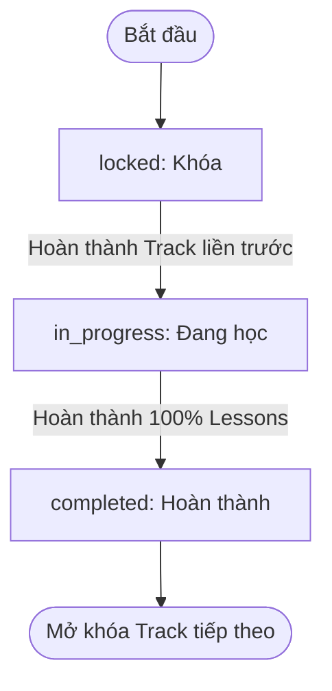
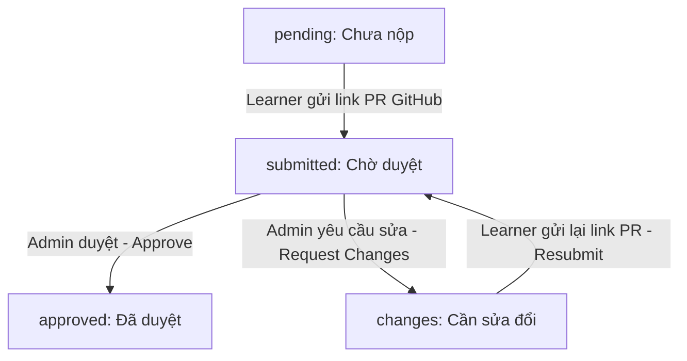
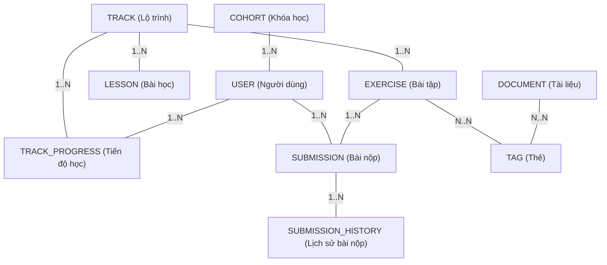

# ĐẶC TẢ YÊU CẦU PHẦN MỀM (SOFTWARE REQUIREMENTS SPECIFICATION)
**Dự án:** RAMP UP (Glinteco e-Learning)  
**Tác giả:** Senior Business Analyst  
**Phiên bản:** 1.0  
**Ngày cập nhật:** 16/06/2026  

---

## 1. Giới thiệu (Introduction)

### 1.1 Mục đích (Purpose)
Tài liệu Đặc tả Yêu cầu Phần mềm (SRS) này mô tả chi tiết các yêu cầu chức năng và phi chức năng của hệ thống **RAMP UP (Glinteco e-Learning)**. Đối tượng sử dụng tài liệu này bao gồm Đội ngũ phát triển (Developers), Đội ngũ kiểm thử (QC/QA), và Product Owner (PO) để thống nhất hướng triển khai sản phẩm.

### 1.2 Phạm vi hệ thống (System Scope)
**RAMP UP** là cổng thông tin đào tạo nội bộ dành cho các kỹ sư mới gia nhập doanh nghiệp (Learners). Hệ thống giúp chuẩn hóa và tự động hóa quy trình onboarding thông qua lộ trình học tập gamified (gamification) kết hợp làm bài tập thực hành tích hợp GitHub. Hệ thống được quản trị và kiểm duyệt bởi các Quản lý Kỹ thuật / Trưởng nhóm (Admins).

### 1.3 Thuật ngữ & Từ viết tắt (Glossary & Abbreviations)
* **Learner (Học viên):** Kỹ sư mới onboarding.
* **Admin (Quản trị viên):** Engineering Manager, Tech Lead hoặc Mentor quản lý lộ trình học tập và review bài tập.
* **Track (Milestone / Lộ trình):** Một chương học lớn (ví dụ: *Local Dev*, *NestJS Service Layer*).
* **Lesson (Bài học):** Đơn vị học tập nhỏ trong Track, chứa nội dung lý thuyết/hướng dẫn.
* **Exercise (Bài tập):** Yêu cầu thực hành thực tế đi kèm với Track.
* **Submission (Bài nộp):** Link GitHub PR do Learner nộp cho một Exercise kèm trạng thái đánh giá.
* **XP (Experience Points):** Điểm kinh nghiệm tích lũy để tăng cấp (Level).
* **Day Streak (Chuỗi ngày hoạt động):** Số ngày liên tục Learner truy cập và hoạt động trên hệ thống.
* **Cursor Pagination (Phân trang con trỏ):** Phương pháp phân trang tối ưu hiệu năng cho danh sách lớn bằng cách sử dụng con trỏ vị trí thay cho `OFFSET` trong database.

---

## 2. Mô tả tổng quan (Overall Description)

### 2.1 Các Tác nhân & Vai trò (System Actors & RBAC)

Hệ thống hỗ trợ 2 vai trò người dùng chính với ma trận phân quyền như sau:

| Mã chức năng | Capability (Chức năng) | Learner (Học viên) | Admin (Quản trị) | Ghi chú |
|---|---|:---:|:---:|---|
| **AUTH-01** | Đăng ký/Đăng nhập (Email, Google OAuth) | ✅ | ✅ | Tất cả người dùng |
| **DASH-01** | Xem Dashboard cá nhân (XP, Level, Streak, Tiến độ) | ✅ | — | Giao diện Learner |
| **DASH-02** | Xem Cohort Analytics (Báo cáo tiến độ cả lớp) | — | ✅ | Giao diện Admin |
| **CURR-01** | Xem timeline, mở khóa và học các bài học | ✅ | ✅ | Admin xem dạng preview |
| **CURR-02** | Tạo, chỉnh sửa, xóa Track & Lesson | — | ✅ | Quyền tác giả của Admin |
| **EXER-01** | Xem yêu cầu bài tập, nộp / sửa đường dẫn PR | ✅ | — | Learner thực hành |
| **EXER-02** | Tạo, chỉnh sửa, xóa Exercise | — | ✅ | Quyền quản lý bài tập |
| **REVW-01** | Duyệt bài tập (Approve / Request Changes) | — | ✅ | Admin chấm điểm |
| **DOCS-01** | Xem thư viện tài liệu, bookmark tài liệu | ✅ | ✅ | Learner bookmark, Admin xem |
| **DOCS-02** | Thêm mới tài liệu, tạo thẻ Tag | — | ✅ | Quản trị thư viện |
| **LEAD-01** | Xem bảng xếp hạng thi đua (Leaderboard) | ✅ | ✅ | Xếp hạng học tập theo XP/Streak |
| **NOTI-02** | Tích hợp và nhận thông báo Slack / Email | ✅ | ✅ | Nhận tin nhắn thông báo tự động |
| **HIST-01** | Xem lịch sử nộp bài & nhận xét cũ | ✅ | ✅ | Lưu audit log các phiên bản nộp bài |
| **COHR-03** | Khởi tạo & Thiết lập cấu hình Cohort | — | ✅ | Quản lý lớp, cấu hình target ngày |

---

## 3. Đặc tả Sơ đồ Chuyển trạng thái (State Machine Matrix)

Quy trình vận hành lõi của RAMP UP phụ thuộc vào hai thực thể chính: **Learning Track** (Lộ trình học) và **Exercise Submission** (Bài nộp thực hành).

### 3.1 Vòng đời trạng thái của Learning Track (Track State Machine)

Một Track đối với mỗi Learner cụ thể sẽ có 3 trạng thái: `locked` (Khóa), `in_progress` (Đang học), và `completed` (Hoàn thành).



**Sơ đồ dạng chữ (ASCII Diagram):**
```text
[Bắt đầu] 
   │
   ▼
┌──────────────┐
│    locked    │ ◄── (Trạng thái mặc định khi tạo mới)
└──────┬───────┘
       │
       │ (Khi hoàn thành Track liền trước)
       ▼
┌──────────────┐
│ in_progress  │
└──────┬───────┘
       │
       │ (Khi tích hoàn thành 100% các Lesson)
       ▼
┌──────────────┐
│  completed   │ ──► [Kích hoạt mở khóa Track tiếp theo]
└──────────────┘
```

#### Quy tắc chuyển đổi trạng thái Track:
1. **locked ➔ in_progress:** 
   * Xảy ra khi Learner hoàn thành bài học cuối cùng của Track liền trước (`lessonsCompleted` = `lessonCount` của Track trước).
   * Ngoại lệ: Track đầu tiên (`order = 1`) sẽ tự động ở trạng thái `in_progress` ngay khi tài khoản được kích hoạt.
2. **in_progress ➔ completed:**
   * Kích hoạt ngay khi Learner đánh dấu hoàn thành bài học cuối cùng trong Track hiện tại (`lessonsCompleted` = `lessonCount`).
   * Hệ thống sẽ tự động kích hoạt tiến trình mở khóa Track tiếp theo (`order = current_order + 1`), chuyển Track đó từ `locked` sang `in_progress`.

---

### 3.2 Vòng đời trạng thái của Bài nộp (Submission State Machine)

Mỗi Exercise đối với một Learner sẽ có các trạng thái bài nộp sau: `pending` (Chưa nộp), `submitted` (Đang chờ duyệt), `approved` (Đã duyệt), và `changes` (Cần sửa đổi).



**Sơ đồ dạng chữ (ASCII Diagram):**
```text
                  ┌──────────────┐
                  │   pending    │ (Bài tập được giao)
                  └──────┬───────┘
                         │
                         │ (Học viên nộp link PR)
                         ▼
                  ┌──────────────┐
                  │  submitted   │ ◄────────────────────────┐
                  └────┬────┬────┘                          │
                       │    │                               │
       ┌───────────────┘    └───────────────┐               │ (Học viên sửa bài
       │ (Admin Approve)                    │ (Admin        │  và nộp lại - Resubmit)
       ▼                                    │ Request       │
┌──────────────┐                            │ Changes)      │
│   approved   │                            ▼               │
│  (Cộng XP)   │                     ┌──────────────┐       │
└──────────────┘                     │   changes    │ ──────┘
                                     └──────────────┘
```

#### Quy tắc chuyển đổi trạng thái Submission:
1. **pending ➔ submitted:**
   * Kích hoạt khi Learner thực hiện hành động `POST /exercises/:id/submissions` với một URL GitHub PR hợp lệ.
   * Bài nộp được đẩy vào Review Queue của Admin.
2. **submitted ➔ approved:**
   * Kích hoạt khi Admin thực hiện hành động `POST /submissions/:id/approve`.
   * Hệ thống cộng điểm XP cho Learner (`xpAwarded` cộng vào `totalXp`), cập nhật cấp độ Level nếu đạt mốc XP mới. Trạng thái chuyển sang đóng (Final state), không cho phép chỉnh sửa hay nộp lại.
3. **submitted ➔ changes:**
   * Kích hoạt khi Admin thực hiện hành động `POST /submissions/:id/request-changes` kèm theo ghi chú lỗi (`reviewNote`).
   * Hệ thống chuyển trạng thái bài tập thành `changes`. Học viên nhận được thông báo yêu cầu sửa bài.
4. **changes ➔ submitted:**
   * Học viên chỉnh sửa code trên GitHub, sau đó quay lại giao diện hệ thống thực hiện `PUT /exercises/:id/submissions` để cập nhật/gửi lại đường dẫn PR.
   * Bài tập quay lại hàng đợi duyệt (Review Queue) của Admin với trạng thái `submitted`.

### 3.3 Tích hợp Thông báo Slack / Email (Slack/Email Integration Flow)

Để rút ngắn thời gian phản hồi giữa học viên và người chấm, hệ thống tích hợp bộ thông báo đẩy tự động:
1. **Sự kiện Learner nộp bài mới (New Submission Event):** Khi Learner thực hiện `POST/PUT` gửi link PR bài tập ➔ Hệ thống kích hoạt webhook gửi tin nhắn thông báo đến kênh Slack chung của đội ngũ Admin/Mentors và email tương ứng để báo có bài nộp cần kiểm duyệt.
2. **Sự kiện Admin đánh giá (Review Event - Approve/Changes):** Khi Admin nhấn `Approve` hoặc `Request Changes` ➔ Hệ thống gửi thông báo trực tiếp qua tin nhắn Slack cá nhân (Direct Message) cho Learner và Email cá nhân của Learner, đính kèm điểm số XP nhận được hoặc nội dung ghi chú yêu cầu sửa đổi (`reviewNote`).

### 3.4 Bảng xếp hạng thi đua (Leaderboard Logic)

Hệ thống cung cấp trang bảng xếp hạng vinh danh nhằm tăng tính tương tác và động lực:
* **Tiêu chí xếp hạng:** Sắp xếp người dùng theo thứ tự ưu tiên: Cấp độ (Level) giảm dần ➔ Tổng điểm kinh nghiệm (XP) giảm dần ➔ Chuỗi ngày hoạt động liên tục (StreakDays) giảm dần ➔ Ngày tham gia (joinedAt) tăng dần.
* **Phạm vi hiển thị:** Cho phép lọc xem xếp hạng trong cùng một Cohort (Cohort-wide Leaderboard) hoặc xem xếp hạng toàn bộ người dùng trong hệ thống (Global Leaderboard).
* **Phân trang:** Áp dụng Cursor Pagination dựa trên cặp giá trị xếp hạng để đảm bảo tốc độ tải trang nhanh và ổn định.

---

## 4. Đặc tả Mô hình Dữ liệu (Domain Model Specifications)

Cấu trúc cơ sở dữ liệu quan hệ được ánh xạ cụ thể dưới bảng sau:



**Sơ đồ dạng chữ (ASCII Diagram):**
```text
┌──────────────┐           ┌──────────────┐
│    COHORT    │──(1..N)──►│     USER     │
└──────────────┘           └──────┬───────┘
                                  │
                                (1..N)
                                  │
                                  ▼
┌──────────────┐           ┌──────────────┐           ┌──────────────┐
│    TRACK     │──(1..N)──►│ TRACK_PROGRESS│◄──(1..N)──│   EXERCISE   │
└──────┬───────┘           └──────────────┘           └──────┬───────┘
       │                                                     │
     (1..N)                                                (1..N)
       │                                                     │
       ▼                                                     ▼
┌──────────────┐           ┌──────────────┐           ┌──────────────┐
│    LESSON    │           │  SUBMISSION  │◄──(1..N)──│     USER     │
└──────────────┘           └──────┬───────┘           └──────────────┘
                                  │
                                (1..N)
                                  │
                                  ▼
                           ┌──────────────┐
                           │SUBMISSION_HIST│ (Lịch sử nộp & sửa)
                           └──────────────┘

┌──────────────┐           ┌──────────────┐
│   DOCUMENT   │◄──(N..N)──│     TAG      │
└──────────────┘           └──────────────┘
```

* **User & Cohort:** Mỗi người dùng thuộc về 1 Cohort (Khóa đào tạo) để Admin theo dõi thống kê theo nhóm.
* **TrackProgress:** Bản ghi liên kết nhiều-nhiều giữa User và Track, lưu số bài học đã hoàn thành (`lessonsCompleted`) và trạng thái học tập của học viên đối với track đó.
* **Submission:** Liên kết giữa User, Exercise và Reviewer (Admin). Lưu đường dẫn PR và trạng thái đánh giá hiện tại.
* **SubmissionHistory (Lưu trữ lịch sử nộp bài):** Lưu tất cả các lần nộp bài (PR links) và nhận xét của từng lần review trước đó của bài tập cụ thể. Mỗi khi Learner cập nhật link PR hoặc Admin cập nhật đánh giá, một bản ghi lịch sử mới sẽ được ghi nhận. Trường bao gồm: `id`, `submissionId` (FK), `prUrl`, `status`, `reviewerId`, `reviewNote`, `submittedAt`, `reviewedAt`.

---

## 5. Yêu cầu phi chức năng (Non-Functional Requirements)

### 5.1 Bảo mật & Xác thực (Security & Authentication)
* **JWT Authentication:** Hệ thống sử dụng cặp token Access Token (hạn dùng 15 phút, lưu trong memory hoặc HTTP-only cookie) và Refresh Token (hạn dùng 7 ngày, lưu trong database/HttpOnly cookie bảo mật chống XSS) để xác thực các request API.
* **Google OAuth 2.0:** Hỗ trợ đăng nhập một chạm bằng email doanh nghiệp (`@glinteco.com` hoặc `@acme.dev`). Tự động đăng ký tài khoản với vai trò mặc định `learner` nếu email hợp lệ và chưa tồn tại trong hệ thống.
* **Authorization Guard:** Mọi API thay đổi dữ liệu cấu trúc học tập (Track, Lesson, Exercise, Tag) hoặc chấm điểm bài tập (Approve, Request Changes) bắt buộc phải qua bộ lọc kiểm tra vai trò `role === 'admin'`. Trả về lỗi `403 Forbidden` nếu vi phạm.

### 5.2 Hiệu năng & Tối ưu hóa (Performance)
* **Cursor-Based Pagination:** Bắt buộc áp dụng phân trang con trỏ đối với các danh sách có khả năng phình to (Thư viện tài liệu, Hàng đợi chấm bài - Review Queue, Danh sách học viên). 
  * Query params chuẩn: `?cursor=<opaque_base64_string>&limit=20` (limit tối đa 50).
  * Payload phản hồi bắt buộc chứa: `{ data: [...], nextCursor: string | null, hasMore: boolean }`.
  * Index database bắt buộc đánh trên cột dùng làm Cursor (ví dụ: kết hợp `createdAt` và `id`) để đảm bảo thời gian truy vấn $O(\log N)$ thay vì $O(N)$ của `OFFSET`.
* **Tốc độ phản hồi API:** 95% request API lấy dữ liệu tĩnh (danh sách bài học, tài liệu) phải hoàn thành dưới **200ms**. Các API nghiệp vụ phức tạp (duyệt bài tập, mở khóa track) phải phản hồi dưới **500ms**.

### 5.3 Tính tương thích & Trải nghiệm giao diện (UI/UX Themes)
* **Responsive Design:** Giao diện tối ưu hiển thị tốt nhất trên Desktop (độ phân giải từ 1280px trở lên) và hỗ trợ hiển thị đọc được trên máy tính bảng (Tablet - từ 768px trở lên).
* **Theme Switching:** Hệ thống hỗ trợ thay đổi giao diện động (Light Mode / Dark Mode) và hiệu ứng scanline giả lập CRT (CRT filter toggle). Toàn bộ mã màu sử dụng biến CSS custom variables (`var(--bg)`, `var(--text)`) để đảm bảo chuyển đổi theme mượt mà tức thì mà không cần tải lại trang.

---

## 6. Các API Bổ sung Đề xuất (Proposed API Extensions)

Để phục vụ cho các phân hệ chức năng mới, chúng tôi đề xuất bổ sung các API endpoint sau vào thiết kế hệ thống API `/api/v1`:

### 6.1 Phân hệ Bảng xếp hạng (Leaderboard)
* **API:** `GET /leaderboard?cohortId=&scope=global&limit=&cursor=`
* **Phân quyền:** Học viên (`learner`) và Quản trị (`admin`).
* **Mô tả:** Trả về danh sách người dùng được xếp hạng thi đua theo thứ tự điểm tích lũy Level/XP và Streak, hỗ trợ phân trang Cursor.

### 6.2 Phân hệ Lịch sử bài nộp (Submission History)
* **API:** `GET /submissions/:id/history`
* **Phân quyền:** Chủ sở hữu bài nộp (Học viên) hoặc Admin.
* **Mô tả:** Trả về mảng danh sách lịch sử nộp bài và các nhận xét review cũ của bài nộp cụ thể, sắp xếp theo thời gian mới nhất.

### 6.3 Phân hệ Quản lý Cohort (Cohort Management)
* **API:** `POST /cohorts`
  * Body: `{ "name": string, "targetRampDays": number }`
* **API:** `PATCH /cohorts/:id`
  * Body: `{ "name"?: string, "targetRampDays"?: number, "isActive"?: boolean }`
* **Phân quyền:** Chỉ dành cho Admin.
* **Mô tả:** Khởi tạo, chỉnh sửa cấu hình thời gian mục tiêu hoặc khóa hoạt động của các Cohort.

### 6.4 Phân hệ Tích hợp thông báo (Notification Settings)
* **API:** `POST /users/me/notifications/slack`
  * Body: `{ "slackMemberId": string }`
* **Phân quyền:** Đã xác thực (Học viên và Admin).
* **Mô tả:** Cập nhật ID tài khoản Slack của người dùng để hệ thống gửi tin nhắn thông báo tự động (DM) qua webhook.
