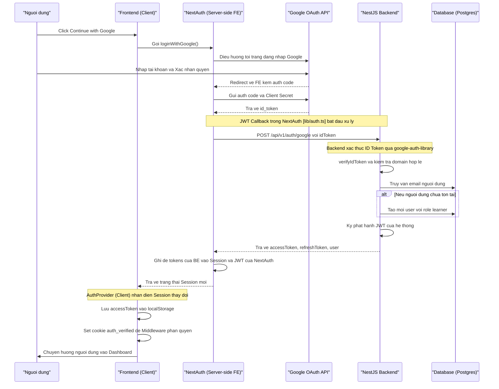

# Luồng Đăng nhập Google (Google OAuth 2.0 Flow)

Tài liệu này mô tả chi tiết luồng đăng nhập và đăng ký nhanh một chạm bằng tài khoản Google doanh nghiệp, sử dụng **NextAuth v5 (Auth.js)** ở Frontend và **NestJS** ở Backend.

---

## 1. Sơ đồ tuần tự (Sequence Diagram)



---

## 2. Chi tiết các bước xử lý

### Bước 1: Kích hoạt từ Client (Frontend)
Khi người dùng click nút "Tiếp tục với Google":
* [`LoginPage.tsx`](../fe/src/components/features/auth/LoginPage.tsx) gọi hàm `loginWithGoogle()`.
* [`AuthProvider.tsx`](../fe/src/providers/AuthProvider.tsx) thực hiện gọi NextAuth SDK:
  ```typescript
  nextAuthSignIn('google', { callbackUrl: '/' });
  ```

### Bước 2: NextAuth Server trao đổi Auth Code với Google
* Trình duyệt chuyển hướng đến Google, người dùng chọn tài khoản và đăng nhập.
* Google trả về mã Auth Code tới Route Handler của NextAuth: `/api/auth/callback/google`.
* NextAuth Server-side tự động dùng `AUTH_GOOGLE_ID` và `AUTH_GOOGLE_SECRET` gửi lên Google API để trao đổi lấy `id_token`.

### Bước 3: Trao đổi Token giữa NextAuth và NestJS Backend
* Ở file cấu hình [`fe/src/lib/auth.ts`](../fe/src/lib/auth.ts), callback `jwt` được kích hoạt:
  ```typescript
  async jwt({ token, account }) {
    if (account?.id_token) {
      // Gửi id_token của Google lên API của Backend
      const res = await fetch(`${API_URL}/auth/google`, {
        method: 'POST',
        headers: { 'Content-Type': 'application/json' },
        body: JSON.stringify({ idToken: account.id_token }),
      });
      const data = await res.json();
      
      // Lưu JWT của Backend (accessToken/refreshToken) vào NextAuth token
      token.accessToken = data.accessToken;
      token.refreshToken = data.refreshToken;
      token.user = data.user;
    }
    return token;
  }
  ```

### Bước 4: Backend NestJS xác thực và tạo User (Find-or-Create)
* Controller `POST /auth/google` nhận `idToken` và gọi [`auth.service.ts`](../be/src/modules/auth/auth.service.ts).
* Backend sử dụng `google-auth-library` để verify chữ ký số của token với các public key của Google.
* Kiểm tra email domain (nếu `ALLOWED_EMAIL_DOMAIN` được thiết lập).
* Kiểm tra trong DB:
  * Nếu người dùng chưa tồn tại: Tự động đăng ký mới với các thông số mặc định (`role: learner`, `XP: 0`, `level: 1`, `streakDays: 0`).
  * Nếu đã tồn tại: Liên kết `googleId` (nếu chưa có) và cập nhật thông tin.
* Backend ký phát hành JWT của hệ thống (AccessToken và RefreshToken) và trả về cho Frontend.

### Bước 5: Đồng bộ Session và Cập nhật trạng thái ở Client
* NextAuth đồng bộ thông tin JWT đã nhận từ backend sang `session` callback.
* Hook `useSession()` của React phát hiện trạng thái đã đăng nhập.
* [`AuthProvider.tsx`](../fe/src/providers/AuthProvider.tsx) thực hiện:
  * Lưu `accessToken` vào `localStorage` phục vụ các request HTTP client thông thường.
  * Thiết lập cookie `auth_verified` chứa quyền (role) để Middleware có thể thực hiện kiểm tra phân quyền trực tiếp ở môi trường Edge/Middleware.
  * Cập nhật React Context State (`user`, `token`).
  * Chuyển hướng người dùng vào trang dashboard (`/dashboard/learner`).

---

## 3. Cấu hình biến môi trường yêu cầu

### Phía Frontend (`fe/.env`)
```env
# Google OAuth 2.0 Credentials
AUTH_GOOGLE_ID=124638674818-rbtfgrnjb311gri42l3t4ujefl5j4l43.apps.googleusercontent.com
AUTH_GOOGLE_SECRET=your_google_client_secret_here

# NextAuth Configs
AUTH_SECRET=your_nextauth_secret_minimum_32_characters
AUTH_URL=http://localhost:6336
```

### Phía Backend (`be/.env`)
```env
# Google OAuth 2.0 Configuration
GOOGLE_CLIENT_ID=124638674818-rbtfgrnjb311gri42l3t4ujefl5j4l43.apps.googleusercontent.com
ALLOWED_EMAIL_DOMAIN=
```
