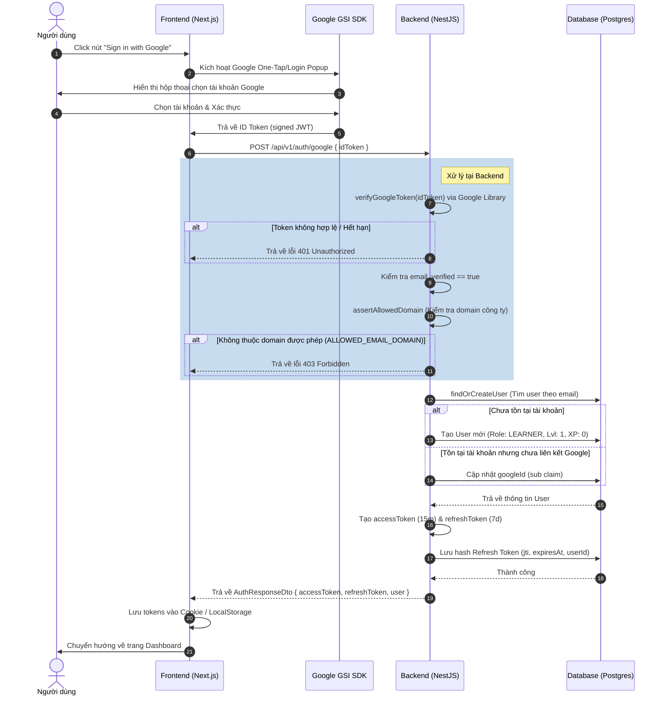

# Sơ đồ Luồng Đăng nhập Google (Google Auth Flow)

Tài liệu này mô tả chi tiết luồng đăng nhập bằng Google OAuth 2.0 trong hệ thống **RAMP UP**, bao gồm cả bước xử lý trên Frontend và Backend (NestJS).

## 1. Sơ đồ trình tự (Sequence Diagram)

---

## 2. Chi tiết các bước xử lý

### Bước 1: Phía Frontend (Client-side)
1. Người dùng kích hoạt đăng nhập bằng Google.
2. Google GSI SDK thực hiện xác thực và trả về một chuỗi `idToken` (được ký bởi khóa bí mật của Google).
3. Frontend gửi request `POST /api/v1/auth/google` đính kèm `idToken` lên Backend.

### Bước 2: Phía Backend (Server-side)
1. **Xác thực Token (`verifyGoogleToken`)**:
   - Sử dụng thư viện `google-auth-library` của Google để verify chữ ký và hạn sử dụng của `idToken` với Client ID của dự án.
   - Nếu lỗi hoặc token giả mạo, ném ra lỗi `401 Unauthorized`.
2. **Kiểm tra Xác thực Email**:
   - Xác thực claim `email_verified` từ Google gửi về phải là `true`.
3. **Kiểm tra Tên miền Doanh nghiệp (`assertAllowedDomain`)**:
   - Nếu cấu hình biến `ALLOWED_EMAIL_DOMAIN` (ví dụ: `glinteco.com`): Hệ thống sẽ đối chiếu với claim hosted domain (`hd`) hoặc hậu tố email của user.
   - Nếu không khớp, ném ra lỗi `403 Forbidden` từ chối truy cập.
4. **Đồng bộ hóa User (`findOrCreateUser`)**:
   - Truy vấn database tìm user theo email.
   - **Trường hợp chưa tồn tại:** Tạo mới bản ghi User với thông tin `email`, `name`, `googleId` (tương ứng với claim `sub` của Google), đặt vai trò mặc định là `LEARNER` và các thông số game hóa ban đầu.
   - **Trường hợp đã tồn tại nhưng chưa liên kết Google:** Cập nhật trường `googleId` của user.
5. **Cấp phát Phiên làm việc (`issueTokens`)**:
   - Tạo UUID ngẫu nhiên làm định danh token (`jti`).
   - Ký `accessToken` (hạn 15 phút) chứa thông tin cơ bản của user.
   - Ký `refreshToken` (hạn 7 ngày) chứa `jti` và `rememberMe`.
   - Băm SHA-256 mã `refreshToken` và lưu vào bảng `refresh_tokens` cùng thời gian hết hạn (`expiresAt`).
6. **Phản hồi**:
   - Trả về cặp token và thông tin tài khoản user đã làm sạch (không kèm password).
