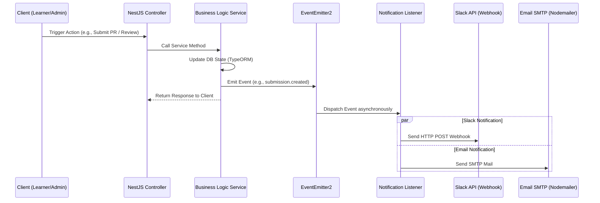

# Event Listeners, Slack Webhooks & Email Notifications Specification

This document details the event-driven notification architecture for the **RAMP UP** (Glinteco e-Learning) system. It specifies the event emitters/listeners, Slack Webhook payload structures (using Slack Block Kit), and HTML Email templates.

---

## 1. Architecture Overview

To decouple the core business logic from notification delivery, the system implements an event-driven architecture using `@nestjs/event-emitter`.



---

## 2. Event Listeners Specification

We define three main system events that trigger notifications:

### 2.1 Event: `submission.created`
* **Triggered by:** `POST /exercises/:id/submissions` (when a learner submits a PR link for the first time).
* **Target Audience:** Admins & Mentors (via Slack Admin Channel and Admin Email).
* **Payload Structure (`SubmissionCreatedEvent`):**
```typescript
export class SubmissionCreatedEvent {
  submissionId: string; // UUID
  userId: string;       // UUID
  userName: string;
  userEmail: string;
  exerciseId: string;   // UUID
  exerciseTitle: string;
  trackId: string;      // UUID
  trackName: string;
  prUrl: string;
  submittedAt: Date;
}
```

### 2.2 Event: `submission.resubmitted`
* **Triggered by:** `PUT /exercises/:id/submissions` (when a learner updates/resubmits a PR link after changes are requested).
* **Target Audience:** Admins & Mentors (via Slack Admin Channel and Admin Email).
* **Payload Structure (`SubmissionResubmittedEvent`):**
```typescript
export class SubmissionResubmittedEvent {
  submissionId: string; // UUID
  userId: string;       // UUID
  userName: string;
  userEmail: string;
  exerciseId: string;   // UUID
  exerciseTitle: string;
  trackId: string;      // UUID
  trackName: string;
  prUrl: string;
  submittedAt: Date;
  previousComments: string[]; // History of feedback comments
}
```

### 2.3 Event: `submission.reviewed`
* **Triggered by:** `POST /submissions/:id/review` (when an admin reviews a submission and updates its status to `approved` or `rejected`/`changes`).
* **Target Audience:** The Learner who submitted (via Slack DM and Personal Email).
* **Payload Structure (`SubmissionReviewedEvent`):**
```typescript
export class SubmissionReviewedEvent {
  submissionId: string;      // UUID
  userId: string;            // UUID
  userName: string;
  userEmail: string;
  slackUserId?: string;      // User's Slack Member ID (for DM)
  exerciseId: string;        // UUID
  exerciseTitle: string;
  status: 'approved' | 'rejected'; // Final review outcome
  adminId: string;           // UUID
  adminName: string;
  comment?: string;          // Admin review feedback
  xpAwarded: number;         // XP gained (0 if rejected)
  newXp: number;             // Updated total XP
  newLevel: number;          // Updated Level
  levelUpgraded: boolean;    // True if user leveled up
  reviewedAt: Date;
}
```

---

## 3. Slack Webhook Payload Specifications

Slack notifications use the **Slack Block Kit** JSON payload to construct premium, high-readability notifications with distinct visual sections and action buttons.

### 3.1 Webhook Config Overview
* **Admin Notifications:** Sent to a shared Admin/Mentor Slack channel using an incoming webhook URL (`SLACK_ADMIN_WEBHOOK_URL`).
* **Learner Notifications:** Sent via Slack Web API `chat.postMessage` directly to the learner's Slack User ID using a Slack Bot Token (`SLACK_BOT_TOKEN`).

### 3.2 Payload: New Submission/Resubmission to Admins
* **Visual Theme:** Primary Blue (`#2563EB`) accent block.
* **Resubmissions:** Highlighted with warning text/emojis if it's a resubmitted task.

```json
{
  "attachments": [
    {
      "color": "#2563EB",
      "blocks": [
        {
          "type": "header",
          "text": {
            "type": "plain_text",
            "text": "🚀 New Exercise Submission Ready for Review",
            "emoji": true
          }
        },
        {
          "type": "section",
          "text": {
            "type": "mrkdwn",
            "text": "*Learner:* Nguyen Van A\n*Track:* NestJS Basics\n*Exercise:* BE-1.2: TypeORM Entities Design\n*PR Link:* <https://github.com/phuongkt-glinteco/glinteco-e-learning-fe/pull/12|#12 TypeORM Entities Setup>"
          }
        },
        {
          "type": "context",
          "elements": [
            {
              "type": "mrkdwn",
              "text": "📅 *Submitted At:* 2026-06-16 22:15 UTC+7"
            }
          ]
        },
        {
          "type": "actions",
          "elements": [
            {
              "type": "button",
              "text": {
                "type": "plain_text",
                "text": "Review on Portal",
                "emoji": true
              },
              "style": "primary",
              "url": "https://rampup.glinteco.com/admin/submissions/c34e89f2-bf89-4e4c-83b4-ac1cb4620d42"
            },
            {
              "type": "button",
              "text": {
                "type": "plain_text",
                "text": "Open PR",
                "emoji": true
              },
              "url": "https://github.com/phuongkt-glinteco/glinteco-e-learning-fe/pull/12"
            }
          ]
        }
      ]
    }
  ]
}
```

### 3.3 Payload: Review Approved to Learner (Direct Message)
* **Visual Theme:** Success Green (`#10B981`) accent block.
* **Gamification Highlight:** Prominent displays for XP gain (+100 XP) and level upgrades using Secondary Violet (`#7C3AED`) to wow the learner.

```json
{
  "attachments": [
    {
      "color": "#10B981",
      "blocks": [
        {
          "type": "header",
          "text": {
            "type": "plain_text",
            "text": "✅ Exercise Approved! Excellent Work",
            "emoji": true
          }
        },
        {
          "type": "section",
          "text": {
            "type": "mrkdwn",
            "text": "Hi *Nguyen Van A*, your submission for *BE-1.2: TypeORM Entities Design* has been *Approved* by *Hoa Team Lead*."
          }
        },
        {
          "type": "section",
          "text": {
            "type": "mrkdwn",
            "text": "*Review Feedback:*\n> _\"Great job on the component structure and schema relations! Nice use of index columns.\"_"
          }
        },
        {
          "type": "section",
          "text": {
            "type": "mrkdwn",
            "text": "⭐ *Rewards & Gamification:*\n• *XP Gained:* `+100 XP`\n• *New Level:* `Level 2 🎓` _(Leveled Up!)_"
          }
        },
        {
          "type": "actions",
          "elements": [
            {
              "type": "button",
              "text": {
                "type": "plain_text",
                "text": "Go to Dashboard",
                "emoji": true
              },
              "style": "primary",
              "url": "https://rampup.glinteco.com/dashboard"
            }
          ]
        }
      ]
    }
  ]
}
```

### 3.4 Payload: Review Changes Requested to Learner (Direct Message)
* **Visual Theme:** Warning Orange (`#F59E0B`) accent block.
* **Action Required:** Immediate link to resubmit instructions.

```json
{
  "attachments": [
    {
      "color": "#F59E0B",
      "blocks": [
        {
          "type": "header",
          "text": {
            "type": "plain_text",
            "text": "⚠️ Changes Requested for Submission",
            "emoji": true
          }
        },
        {
          "type": "section",
          "text": {
            "type": "mrkdwn",
            "text": "Hi *Nguyen Van A*, reviewer *Hoa Team Lead* has requested changes on your submission for *BE-1.2: TypeORM Entities Design*."
          }
        },
        {
          "type": "section",
          "text": {
            "type": "mrkdwn",
            "text": "*Reviewer's Feedback & Required Changes:*\n> _\"Please add validation rules (class-validator) to the UserDto. Specifically, check the email format constraint. Let's fix this and resubmit!\"_"
          }
        },
        {
          "type": "actions",
          "elements": [
            {
              "type": "button",
              "text": {
                "type": "plain_text",
                "text": "Resubmit PR Link",
                "emoji": true
              },
              "style": "primary",
              "url": "https://rampup.glinteco.com/exercises/c34e89f2-bf89-4e4c-83b4-ac1cb4620d42"
            }
          ]
        }
      ]
    }
  ]
}
```

---

## 4. Email Template Specifications

The emails are sent as responsive HTML formatted documents using a clean, modern aesthetic with colors from `docs/DESIGN.md`.

* **Font Family:** Inter, system-ui, sans-serif
* **Header Color:** Primary Blue `#2563EB`
* **Gamification Accent:** Secondary Violet `#7C3AED`
* **Background Light:** `#F8FAFC`
* **Card Surface:** `#FFFFFF` with `#E2E8F0` borders

### 4.1 Email Template: Admin Notification (New Submission)
* **Subject:** `[RAMP UP] New Submission: {userName} - {exerciseTitle}`

```html
<!DOCTYPE html>
<html>
<head>
  <meta charset="utf-8">
  <title>New Submission Pending Review</title>
  <style>
    body {
      font-family: 'Inter', system-ui, sans-serif;
      background-color: #F8FAFC;
      color: #0F172A;
      margin: 0;
      padding: 0;
      -webkit-font-smoothing: antialiased;
    }
    .wrapper {
      width: 100%;
      padding: 32px 0;
    }
    .container {
      max-width: 600px;
      margin: 0 auto;
      background-color: #FFFFFF;
      border: 1px solid #E2E8F0;
      border-radius: 8px;
      overflow: hidden;
      box-shadow: 0 1px 3px rgba(15, 23, 42, 0.05);
    }
    .header {
      background-color: #2563EB;
      color: #FFFFFF;
      padding: 24px;
      text-align: center;
    }
    .header h1 {
      margin: 0;
      font-size: 20px;
      font-weight: 700;
      letter-spacing: -0.02em;
    }
    .content {
      padding: 32px 24px;
    }
    .meta-table {
      width: 100%;
      margin: 20px 0;
      border-collapse: collapse;
    }
    .meta-table td {
      padding: 10px 0;
      border-bottom: 1px solid #F1F5F9;
    }
    .meta-table td.label {
      font-weight: 600;
      color: #475569;
      width: 120px;
    }
    .meta-table td.value {
      color: #0F172A;
    }
    .btn-container {
      text-align: center;
      margin-top: 28px;
    }
    .btn-primary {
      display: inline-block;
      background-color: #2563EB;
      color: #FFFFFF;
      text-decoration: none;
      padding: 12px 24px;
      border-radius: 6px;
      font-weight: 600;
      font-size: 14px;
    }
    .footer {
      text-align: center;
      padding: 20px;
      font-size: 12px;
      color: #64748B;
      border-top: 1px solid #F1F5F9;
      background-color: #F8FAFC;
    }
  </style>
</head>
<body>
  <div class="wrapper">
    <div class="container">
      <div class="header">
        <h1>RAMP UP Portal</h1>
      </div>
      <div class="content">
        <p style="font-size: 16px; line-height: 24px; margin-top: 0;">Hi Admins & Mentors,</p>
        <p style="font-size: 15px; color: #334155; line-height: 24px;">A learner has submitted a task for your review. Below are the details:</p>
        
        <table class="meta-table">
          <tr>
            <td class="label">Learner</td>
            <td class="value">Nguyen Van A (nguyena@glinteco.com)</td>
          </tr>
          <tr>
            <td class="label">Track</td>
            <td class="value">NestJS Basics</td>
          </tr>
          <tr>
            <td class="label">Exercise</td>
            <td class="value">BE-1.2: TypeORM Entities Design</td>
          </tr>
          <tr>
            <td class="label">PR Link</td>
            <td class="value"><a href="https://github.com/phuongkt-glinteco/glinteco-e-learning-fe/pull/12" style="color: #2563EB;">#12 TypeORM Entities Setup</a></td>
          </tr>
          <tr>
            <td class="label">Submitted</td>
            <td class="value">2026-06-16 22:15 (UTC+7)</td>
          </tr>
        </table>
        
        <div class="btn-container">
          <a href="https://rampup.glinteco.com/admin/submissions/c34e89f2-bf89-4e4c-83b4-ac1cb4620d42" class="btn-primary">Review Submission</a>
        </div>
      </div>
      <div class="footer">
        This is an automated email from RAMP UP Onboarding Portal.
      </div>
    </div>
  </div>
</body>
</html>
```

### 4.2 Email Template: Review Result (Approved / Leveled Up)
* **Subject:** `[RAMP UP] Review Approved: {exerciseTitle} 🎉`

```html
<!DOCTYPE html>
<html>
<head>
  <meta charset="utf-8">
  <title>Submission Approved!</title>
  <style>
    body {
      font-family: 'Inter', system-ui, sans-serif;
      background-color: #F8FAFC;
      color: #0F172A;
      margin: 0;
      padding: 0;
    }
    .wrapper {
      width: 100%;
      padding: 32px 0;
    }
    .container {
      max-width: 600px;
      margin: 0 auto;
      background-color: #FFFFFF;
      border: 1px solid #E2E8F0;
      border-radius: 8px;
      overflow: hidden;
      box-shadow: 0 1px 3px rgba(15, 23, 42, 0.05);
    }
    .header {
      background-color: #10B981; /* Success Green */
      color: #FFFFFF;
      padding: 24px;
      text-align: center;
    }
    .header h1 {
      margin: 0;
      font-size: 20px;
      font-weight: 700;
      letter-spacing: -0.02em;
    }
    .content {
      padding: 32px 24px;
    }
    .feedback-box {
      background-color: #F8FAFC;
      border-left: 4px solid #10B981;
      padding: 16px;
      margin: 20px 0;
      font-style: italic;
      color: #334155;
    }
    .gamification-box {
      background-color: #F5F3FF; /* Light violet */
      border: 1px dashed #7C3AED; /* Secondary Violet */
      border-radius: 6px;
      padding: 20px;
      margin: 24px 0;
      text-align: center;
    }
    .gamification-title {
      font-weight: 700;
      color: #7C3AED;
      margin-bottom: 8px;
      font-size: 16px;
    }
    .badge {
      display: inline-block;
      background-color: #7C3AED;
      color: #FFFFFF;
      padding: 6px 12px;
      border-radius: 9999px;
      font-weight: 700;
      font-size: 12px;
      margin-top: 8px;
    }
    .btn-container {
      text-align: center;
      margin-top: 28px;
    }
    .btn-primary {
      display: inline-block;
      background-color: #2563EB;
      color: #FFFFFF;
      text-decoration: none;
      padding: 12px 24px;
      border-radius: 6px;
      font-weight: 600;
      font-size: 14px;
    }
    .footer {
      text-align: center;
      padding: 20px;
      font-size: 12px;
      color: #64748B;
      border-top: 1px solid #F1F5F9;
      background-color: #F8FAFC;
    }
  </style>
</head>
<body>
  <div class="wrapper">
    <div class="container">
      <div class="header">
        <h1>Approved! keep it up 🚀</h1>
      </div>
      <div class="content">
        <p style="font-size: 16px; line-height: 24px; margin-top: 0;">Hi Nguyen Van A,</p>
        <p style="font-size: 15px; color: #334155; line-height: 24px;">Your submission for <strong>BE-1.2: TypeORM Entities Design</strong> has been approved by <strong>Hoa Team Lead</strong>.</p>
        
        <div class="feedback-box">
          "Great job on the component structure and schema relations! Nice use of index columns."
        </div>

        <div class="gamification-box">
          <div class="gamification-title">🏆 Rewards Earned</div>
          <div style="font-size: 24px; font-weight: 800; color: #1E1B4B; margin: 8px 0;">+100 XP</div>
          <div style="color: #4C1D95; font-size: 14px;">Your progress streak is going strong! Keep moving forward.</div>
          <div class="badge">Leveled Up to Level 2! 🎓</div>
        </div>
        
        <div class="btn-container">
          <a href="https://rampup.glinteco.com/dashboard" class="btn-primary">View My Portal</a>
        </div>
      </div>
      <div class="footer">
        This is an automated email from RAMP UP Onboarding Portal.
      </div>
    </div>
  </div>
</body>
</html>
```

### 4.3 Email Template: Review Changes Requested
* **Subject:** `[RAMP UP] Changes Requested: {exerciseTitle}`

```html
<!DOCTYPE html>
<html>
<head>
  <meta charset="utf-8">
  <title>Changes Requested</title>
  <style>
    body {
      font-family: 'Inter', system-ui, sans-serif;
      background-color: #F8FAFC;
      color: #0F172A;
      margin: 0;
      padding: 0;
    }
    .wrapper {
      width: 100%;
      padding: 32px 0;
    }
    .container {
      max-width: 600px;
      margin: 0 auto;
      background-color: #FFFFFF;
      border: 1px solid #E2E8F0;
      border-radius: 8px;
      overflow: hidden;
      box-shadow: 0 1px 3px rgba(15, 23, 42, 0.05);
    }
    .header {
      background-color: #F59E0B; /* Warning Orange */
      color: #FFFFFF;
      padding: 24px;
      text-align: center;
    }
    .header h1 {
      margin: 0;
      font-size: 20px;
      font-weight: 700;
      letter-spacing: -0.02em;
    }
    .content {
      padding: 32px 24px;
    }
    .feedback-box {
      background-color: #FFFBEB; /* Light Amber background */
      border-left: 4px solid #F59E0B;
      padding: 16px;
      margin: 20px 0;
      color: #78350F;
      font-size: 14px;
      line-height: 22px;
    }
    .btn-container {
      text-align: center;
      margin-top: 28px;
    }
    .btn-primary {
      display: inline-block;
      background-color: #F59E0B;
      color: #FFFFFF;
      text-decoration: none;
      padding: 12px 24px;
      border-radius: 6px;
      font-weight: 600;
      font-size: 14px;
    }
    .footer {
      text-align: center;
      padding: 20px;
      font-size: 12px;
      color: #64748B;
      border-top: 1px solid #F1F5F9;
      background-color: #F8FAFC;
    }
  </style>
</head>
<body>
  <div class="wrapper">
    <div class="container">
      <div class="header">
        <h1>Action Required: Update Your PR</h1>
      </div>
      <div class="content">
        <p style="font-size: 16px; line-height: 24px; margin-top: 0;">Hi Nguyen Van A,</p>
        <p style="font-size: 15px; color: #334155; line-height: 24px;">Your submission for <strong>BE-1.2: TypeORM Entities Design</strong> has been reviewed. <strong>Hoa Team Lead</strong> requested some changes before this task can be approved.</p>
        
        <div class="feedback-box">
          <strong>Reviewer Feedback:</strong><br>
          "Please add validation rules (class-validator) to the UserDto. Specifically, check the email format constraint. Let's fix this and resubmit!"
        </div>
        
        <p style="font-size: 14px; color: #475569; line-height: 22px;">Once you have addressed the feedback and pushed the changes to your branch, please update your PR submission link on the portal to re-request a review.</p>

        <div class="btn-container">
          <a href="https://rampup.glinteco.com/exercises/c34e89f2-bf89-4e4c-83b4-ac1cb4620d42" class="btn-primary">Update Submission</a>
        </div>
      </div>
      <div class="footer">
        This is an automated email from RAMP UP Onboarding Portal.
      </div>
    </div>
  </div>
</body>
</html>
```
