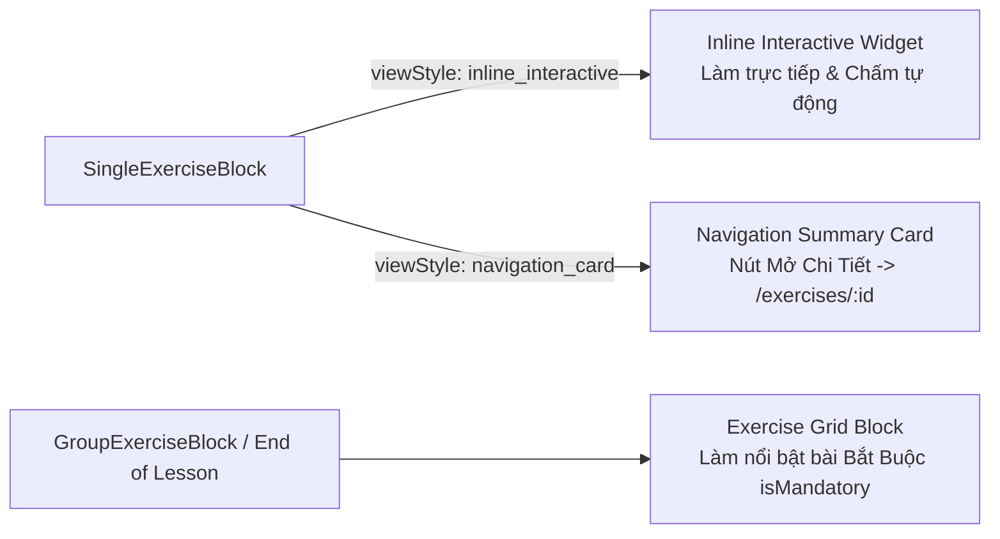

# Exercise Types & Lesson Display Standards

Tài liệu này định nghĩa tiêu chuẩn chính thức về cấu trúc dữ liệu, cơ chế soạn thảo Admin trong Puck Editor và quy chuẩn hiển thị cho Learner đối với 3 loại bài tập trong hệ thống E-Learning: **`PR_REVIEW`**, **`QUIZ`**, và **`FILL_IN_BLANK`**.

---

## 1. Phân Loại Bài Tập & Cơ Chế Dữ Liệu Backend

Hệ thống hỗ trợ 3 loại bài tập (`type`), được quy định trong `CreateExerciseDto` và `ExerciseDetailDto` ([`fe/src/services/client/types.gen.ts`](file:///home/lamnt/Projects/learn/glinteco-e-learning-fe/fe/src/services/client/types.gen.ts)):

| Loại (`type`) | Mô tả & Mục đích | Cơ chế Dữ liệu Đặc thù |
|---|---|---|
| **`PR_REVIEW`** | Bài tập thực hành lớn / chấm tự luận qua Pull Request hoặc nộp link. | Sử dụng các trường mô tả chi tiết: `brief`, `overview`, `objectives` (Acceptance Criteria), `steps`. |
| **`QUIZ`** | Trắc nghiệm chọn đáp án đúng A/B/C/D. | Sử dụng mảng `questionsData: ExerciseQuestionDto[]` (gồm `id`, `prompt`, `options`, `correctAnswer`). |
| **`FILL_IN_BLANK`** | Bài tập điền từ vào chỗ trống trong câu hỏi hoặc đoạn văn bản. | Sử dụng mảng `questionsData: ExerciseQuestionDto[]` (gồm `id`, `prompt`, `correctAnswer`; trường `options` để trống). |

### 1.1. Xử lý trường bắt buộc `PR_Review` đối với `QUIZ` & `FILL_IN_BLANK`
Trong schema Backend, các trường `brief`, `overview`, `objectives`, `steps` là bắt buộc. Khi Admin tạo bài tập loại `QUIZ` hoặc `FILL_IN_BLANK`:
- **Giao diện Admin Form / Dialog:** Ẩn hoàn toàn 4 trường này để tránh Admin nhập liệu dư thừa.
- **Frontend Serialization:** Tự động điền dữ liệu mẫu hợp lệ trước khi gửi API `POST/PUT /exercises`:
  ```typescript
  const serializedPayload = {
    ...formData,
    brief: formData.brief || `Bài tập thực hành dạng ${formData.type}`,
    overview: formData.overview || 'Hoàn thành các câu hỏi để kiểm tra và củng cố kiến thức bài học.',
    objectives: formData.objectives?.length ? formData.objectives : ['Hoàn thành chính xác các câu hỏi theo yêu cầu'],
    steps: formData.steps?.length ? formData.steps : ['Đọc kỹ câu hỏi', 'Lựa chọn hoặc điền đáp án chính xác', 'Nộp bài để hệ thống tự động chấm điểm'],
  };
  ```

### 1.2. Cơ chế Bảo mật & Chấm Điểm Tự Động (`submit-auto`)
- **Khi Learner tải bài tập (`GET /exercises/{id}`):** Backend tự động **strip (loại bỏ) trường `correctAnswer`** trong mảng `questionsData`.
- **Chấm điểm tự động (`POST /exercises/{id}/submit-auto`):** Learner gửi mảng `{ questionId, answer }` (với `FILL_IN_BLANK` là chuỗi text học viên nhập). Backend tự động đối chiếu chính xác đáp án và trả về kết quả `passed: boolean` cùng điểm số `%`.

---

## 2. Tiêu Chuẩn Soạn Thảo Admin — Puck Editor Blocks

Trong bộ soạn thảo bài học Puck Editor, Bài tập được chuẩn hóa thành 2 Block chuyên dụng:

```json
{
  "SingleExerciseBlock": {
    "title": "Tên bài tập",
    "isMandatory": true,
    "tag": "JavaScript",
    "difficulty": "Beginner",
    "estimatedTime": "10m",
    "xp": 50,
    "type": "QUIZ",
    "viewStyle": "inline_interactive",
    "content": "..."
  }
}
```

### 2.1. Block 1: `SingleExerciseBlock`
Block đại diện cho 1 bài tập đơn nhúng trong mạch bài học với các trường thuộc tính:
- `title` *(string)*: Tiêu đề bài tập.
- `isMandatory` *(boolean)*: Cờ đánh dấu bài tập bắt buộc để hoàn thành Lesson.
- `tag`, `difficulty`, `estimatedTime`, `xp`: Các thông tin metadata của bài tập.
- `type` *(`'PR_REVIEW' | 'QUIZ' | 'FILL_IN_BLANK'`)*: Loại bài tập.
- **`viewStyle` *(`'inline_interactive' | 'navigation_card'`)*:**
  - Quy định cách hiển thị trên trang Lesson của Learner.
  - *Quy tắc ràng buộc:* Nếu `type === 'PR_REVIEW'`, `viewStyle` bị khóa ở giá trị duy nhất là `'navigation_card'` (Thẻ điều hướng). Nếu `type === 'QUIZ' | 'FILL_IN_BLANK'`, Admin được chọn `'inline_interactive'` (làm ngay trong bài học) hoặc `'navigation_card'`.
- **`content` *(special trigger field)*:**
  - Trường đặc biệt chứa toàn bộ thông tin chi tiết còn lại của bài tập.
  - Khi Admin nhấp vào nút chỉnh sửa `content` trên sidebar Puck, hệ thống dựa vào `type` để hiển thị Dialog tương ứng:
    - `QUIZ` / `FILL_IN_BLANK` $\rightarrow$ Mở **Questions Builder Dialog** (thêm/sửa câu hỏi, đáp án đúng).
    - `PR_REVIEW` $\rightarrow$ Mở **PR Review Details Dialog** (nhập `brief`, `overview`, `objectives`, `steps`).

### 2.2. Block 2: `GroupExerciseBlock`
Block tổng hợp nhóm bài tập (thường đặt ở cuối Lesson):
- Cho phép Admin chọn danh sách bài tập đã có trên Canvas hoặc chọn từ thư viện bài tập (`ExercisePickerField`).

### 2.3. Single Source of Truth cho Puck Editor (`useLessonExercisesStore`)
Để tránh việc phân tích DOM/Canvas (`puck.data.content`) dễ bỏ sót bài tập nằm trong sidebar hoặc block lồng nhau:
- Sử dụng **Zustand Store (`useLessonExercisesStore`)** làm Nguồn Dữ Liệu Duy Nhất (Single Source of Truth) trong ngữ cảnh Lesson Editor.
- Tất cả các `SingleExerciseBlock` và `ExercisePickerField` khi mount/update đều tự động đăng ký bài tập vào store (`registerExercise(id, data)`).
- `GroupExerciseBlock` subscribe trực tiếp vào store để hiển thị danh sách bài tập đầy đủ và chính xác nhất.

---

## 3. Tiêu Chuẩn Hiển Thị Learner (Lesson View & Exercise Detail)

Giao diện Learner hiển thị bài tập theo 3 chế độ tương ứng với `type` và `viewStyle`:



### 3.1. Chế độ 1: Inline Interactive Widget (`viewStyle: 'inline_interactive'`)
- **Áp dụng cho:** `QUIZ` và `FILL_IN_BLANK`.
- **Hiển thị:** Render trực tiếp toàn bộ danh sách câu hỏi ngay bên trong nội dung bài học.
- **Tương tác:** Học viên chọn đáp án / nhập từ điền khuyết và bấm nút **"Nộp bài kiểm tra"** ngay tại block. Hệ thống gọi `POST /exercises/{id}/submit-auto` và hiển thị kết quả đạt/chưa đạt ngay lập tức mà không cần rời trang Lesson.

### 3.2. Chế độ 2: Navigation Summary Card (`viewStyle: 'navigation_card'`)
- **Áp dụng cho:** `PR_REVIEW` (bắt buộc) hoặc `QUIZ` / `FILL_IN_BLANK` dài.
- **Hiển thị:** Thẻ Card tóm tắt gồm Tiêu đề, Badge thể loại (`PR_REVIEW`, `QUIZ`, `FILL_IN_BLANK`), Điểm thưởng XP, Thời gian ước tính, Trạng thái cá nhân (`status`).
- **Tương tác:** Nút **"Mở bài tập"** điều hướng người học vào trang chuyên sâu `/exercises/{id}`.

### 3.3. Chế độ 3: Lesson Exercises Group Block (Nhóm bài tập cuối bài học)
- **Áp dụng cho:** Block tổng kết cuối Lesson (`GroupExerciseBlock` hoặc mặc định của Lesson).
- **Hiển thị:** Grid danh sách các bài tập thuộc bài học (`GET /exercises?lessonId={id}`).
- **Điểm nhấn UX:**
  - Huy hiệu nổi bật **"Bắt buộc (Mandatory)"** với bài tập có `isMandatory: true`.
  - Hiển thị tiến độ hoàn thành chung của nhóm bài tập.
  - Nút hành động nhanh dẫn tới trang chi tiết hoặc làm bài.
